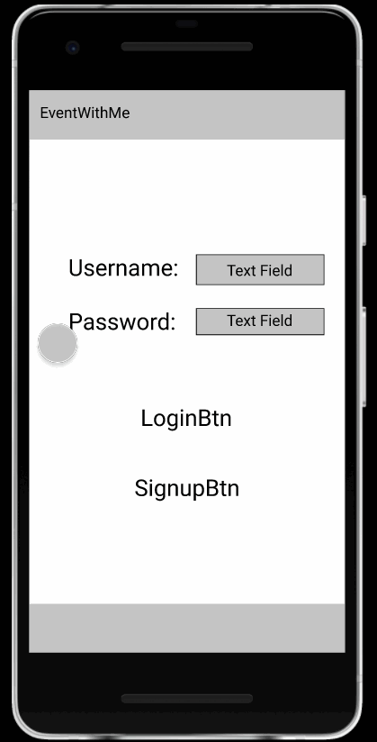

# EventWithMe

## Table of Contents
1. [Overview](#Overview)
1. [Product Spec](#Product-Spec)
1. [Wireframes](#Wireframes)
2. [Schema](#Schema)

## Overview
### Description
App allows users to create account and chat with people going to the same events and schedule meet ups 

### App Evaluation
[Evaluation of your app across the following attributes]
- **Category:** Social
- **Mobile:** No website, just a mobile app
- **Story:** Allows users to find others attending concerts and similar events in order to meet and attend together
- **Market:** People who go to concerts or similar events
- **Habit:** Possibly not very habit-forming? It would only be used when planning to attend an event
- **Scope:** The app is planned to have a limited scope, only creating an environment with chat rooms for nearby events

## Product Spec

### 1. User Stories (Required and Optional)

**Required Must-have Stories**

* User can create an account and login
* User can view and change their displayed name, picture, location, etc.
* User can view a list of nearby events
* User can sign up to attend an event
* User can chat with others attending the events
* User can view events they signed up for

**Optional Nice-to-have Stories**

* User can use phone GPS to detect location
* User can choose to sort either by most recent or by distance
* User can privately message people attending
* User can create groups with group chats for people attending together
* User can receive notifications about new messages or new events in their area
* User can change privacy settings and notification settings
* User can view other people's profiles

### 2. Screen Archetypes

* Login
    * User can login
* Register
    * User can make a new account
* Event Stream
    * User can view a list of nearby events
* My Events
    * User can view events they signed up for
* Event Detail (Viewing)
    * User can sign up to attend an event
* Event Detail (Attending)
    * User can chat with other attendees
* Messages
    * User can privately message people attending
* Profile
    * User can view and change their displayed name, picture, location, etc.
* Settings
    * User can change privacy settings and notification settings

### 3. Navigation

**Tab Navigation** (Tab to Screen)

* Event Stream
* My Events
* Messaging
* Profile

**Flow Navigation** (Screen to Screen)

* Login
    * Event Stream
* Register
    * Event Stream
* Event Stream
    * Event Detail (Viewing or Attending depending on what is selected)
* My Events
    * Event Detail (Attending)
* Event Detail (Viewing)
* Event Detail (Attending)
    * Messages with another user
* Messages
* Profile
    * Settings
* Settings

## Wireframes

### Interactive Prototype

GIF created with [LiceCap](http://www.cockos.com/licecap/).

## Schema 
[This section will be completed in Unit 9]
### Models
[Add table of models]
### Networking
- [Add list of network requests by screen ]
- [Create basic snippets for each Parse network request]
- [OPTIONAL: List endpoints if using existing API such as Yelp]
