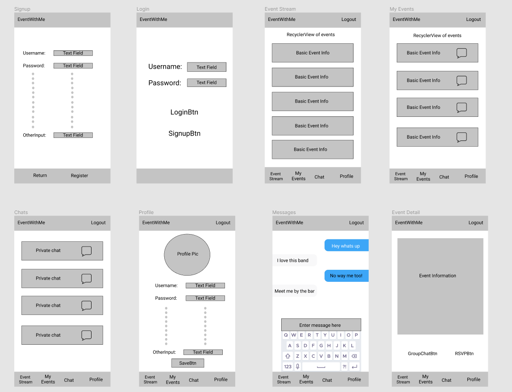
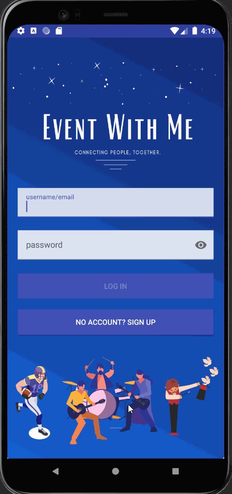
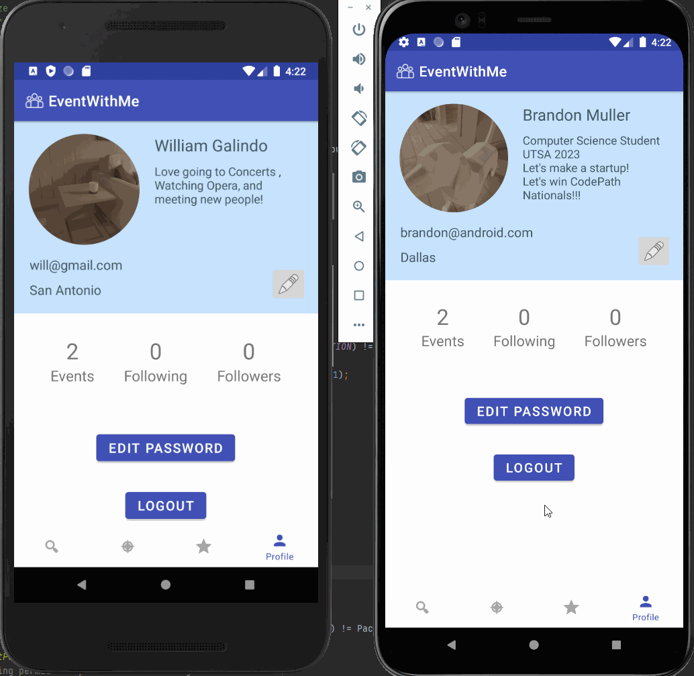

# EventWithMe

## Table of Contents
1. [Overview](#Overview)
1. [Product Spec](#Product-Spec)
1. [Wireframes](#Wireframes)
2. [Schema](#Schema)
3. [Feature Demos](#Feature-Gifs)

## Overview
### Description
EventWithMe allows people to connect with each other over events. Users find events near them and favorite them to track them and then connect to the favorited event group chats. [Live Demo at the University at Texas in San Antonio](https://www.youtube.com/watch?v=8XOlISfdpbU&ab_channel=BrandonMuller)

### App Evaluation
[Evaluation of your app across the following attributes]
- **Category:** Social
- **Mobile:** No website, just a mobile app
- **Story:** Allows users to find others attending concerts and similar events in order discuss events and/or organize meet ups
- **Market:** People who go to events including but not limited to theater, concerts, or sports
- **Habit:** Habits are formed by keeping users interested and involved in event group chats and notifying users of events nearby
- **Scope:** The scope of the app consists of making a messaging platform, implementing multiple APIs, and possibly full deployment.

### Tech Stack
- Android Studio with Java
- Parse database through back4app hosting
- TicketMaster API & Google Maps API
- Android Volley Library for restful client connection
- Picasso & Glide libraries for image loading

## Product Spec

### 1. User Stories (Required and Optional)

**Required Must-have Stories**

- [x] User can create an account and login
- [x] User can view and change their displayed name, picture, location, etc.
- [x] User can view a list of nearby events
- [x] User can favorite events and view their favorited events
- [x] User can chat with others attending the events
- [x] User can change password

**Optional Nice-to-have Stories**

- [x] User can use phone GPS to detect location
- [x] User can view other people's profiles
- [ ] User can choose to sort either by most recent or by distance
- [ ] User can privately message people attending
- [ ] User can receive notifications about new messages or new events in their area
- [ ] User can change privacy settings and notification settings

### 2. Screen Archetypes

* Login
    * User can login
* Register
    * User can make a new account
* Event Stream
    * User can view a list of nearby events
* My Events
    * User can view events they signed up for
* Event Detail (Viewing)
    * User can sign up to attend an event
    * User can chat with other attendees
* Messages
    * User can privately message people attending
* Profile
    * User can view and change their displayed name, picture, location, etc.
* Settings
    * User can change privacy settings and notification settings

### 3. Navigation

**Tab Navigation** (Tab to Screen)

* Search
* Event Stream
* Favorites
* Profile

**Flow Navigation** (Screen to Screen)

* Login
    * Event Stream
    * Signup
* Register
    * Login
    * Event Stream
* Event Stream
    * Event Detail 
    * Favorites
    * Profile
    * Search
* Favorites
    * Event Stream
    * Messages
    * Profile
    * Search
* Event Detail 
    * Event Stream
* Messages
    * Favorites
* Profile
    * Event Stream
    * Search
    * Favorites
    * Login

## Wireframes



### Interactive Prototype


GIF created with [LiceCap](http://www.cockos.com/licecap/).

## Schema 
### Models

**Event**
| Property  | Type | Description |
| ------------- | ------------- | ------------- |
| eventName  | String  | name of an event  |
| location  | String  | location of an event  |
| date  | DateTime  | date of event  |
| description  | String  | description of an event  |
| occupancy  | String  | max amount of attendees  |
| venueName  | String  | name of venue  |
| eventType  | String  | type of event  |

**User**
| Property  | Type | Description |
| ------------- | ------------- | ------------- |
| name  | String  | name of an user  |
| username  | String  | username of an user  |
| email  | String  | email of user  |
| password  | String  | password of user  |
| photo  | image  | photo of user for profile  |
| location  | String  | location of user  |

**Message**
| Property  | Type | Description |
| ------------- | ------------- | ------------- |
| content  | String  | content of message  |
| timestamp  | String  | time message was sent  |
| username  | String  | username attached to message  |

### Networking
* Login
    * (read/GET) Query user data to verify login from parse database
* Register
    * (read/GET) user data from 
    * (create/POST) create user in 
* Event Stream
    * (read/GET) event data from event API
* Favorites
    * (read/GET) event data and user data related to event from event API 
    ```java
        ParseQuery<Post> query = ParseQuery.getQuery(Event.class);
        query.include(Event.KEY_USER);
        query.findInBackground(new FindCallback<Event>() {
            @Override
            public void done(List<Event> events, ParseException e) {
                if(e != null){
                    Log.e(TAG, "Issue with getting events", e);
                    return;
                }
		//When events pulled up with success then list them
                for(Event event : events){
                    Log.i(TAG, "Event: " + event.getEventName() + "Event chat: " + event.getEventChat());
                }
            }
        });
    ```
* Event Detail 
    * (read/GET) event data from event API
    ```java
        ParseQuery<Post> query = ParseQuery.getQuery(Event.class);
        query.include(Event.KEY_USER);
        query.findInBackground(new FindCallback<Event>() {
            @Override
            public void done(Event event, ParseException e) {
                if(e != null){
                    Log.e(TAG, "Issue with getting event", e);
                    return;
                }
                
             	Log.i(TAG, "Event: " + event.getEventName() + ", description: " + event.getDescription() + ", time and location: " + event.getDateTime() + ", " + event.getLocation());           
            }
        });
    ```
* Messages
    * (read/GET) reads messages 
    * (create/POST) create message 
* Profile
    * (read/GET) reads user profile  
    ```java
    	ParseQuery<Post> query = ParseQuery.getQuery(Profile.class);
    	query.include(Profile.KEY_USER);
    	query.findInBackground(new FindCallback<Profile>() {
        	@Override
        	public void done(List<Profile> profiles, ParseException e) {
            		if(e != null){
                		Log.e(TAG, "No profile found", e);
                		return;
            		}
			//When profile pulled up with success then list
            		for(Profile profile : profiles){
               			Log.i(TAG, "Profile: " + profile.getProfileName());
            		}
        	}
    	});
    ```
    * (Update/PUT) Update user profile data
    * (delete) delete account

### Endpoints
- TicketMaster API
- Google Maps API
- Parse database hoted by back4app

- [Add list of network requests by screen ]
- [Create basic snippets for each Parse network request]

## Feature Gifs
### Login & Signup



### GPS Geolocation service with Google Maps API


### Event Stream with Ticketmaster API


### User Profile


### Messaging

